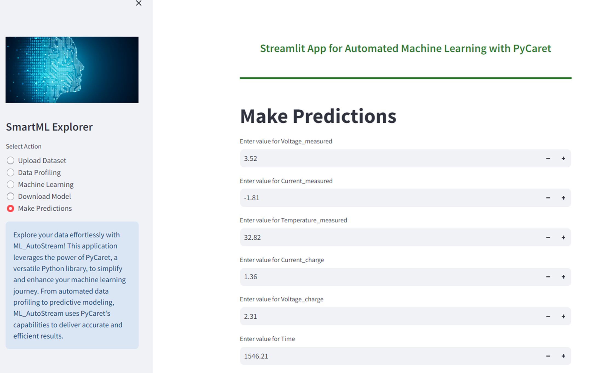
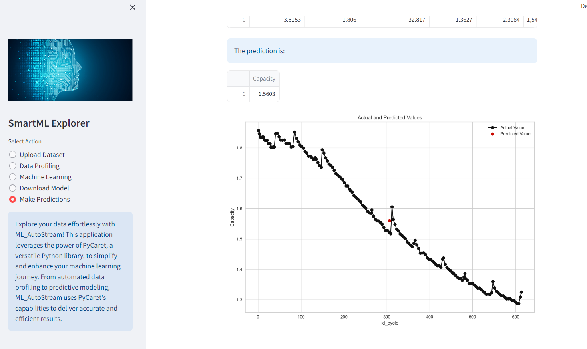

# SmartML Explorer 🚀

SmartML Explorer is an interactive Streamlit application for automated machine learning using the PyCaret library. This repository provides a comprehensive overview of the application's functionalities and highlights its key features. The project aims to simplify the machine learning journey by leveraging PyCaret's capabilities within a Streamlit app. Users can effortlessly upload datasets, perform automated data profiling, explore machine learning models, and make predictions, all through an intuitive interface.

🔍 **Data Exploration and Profiling:**

- Gain insights into datasets through automated profiling and visualizations.

📊 **Machine Learning Exploration:**

- Select a target variable for machine learning exploration.
- Experiment settings and best-performing models are displayed.

🚀 **Making Predictions:**

- Input values for prediction, and the app displays the predicted outcomes.

## Programs, Tools, and Libraries Used

### Programs:

- **Python:** 🐍 Programming language used for app development and data analysis.
- **Visual Studio Code:** 💻 IDE for coding and project management.
- **Streamlit:** 🌐 Python library for building interactive web applications.

### Libraries:

1. **Pandas:** 🐼 Data manipulation library for reading, analyzing, and manipulating datasets.
2. **YData Profiling:** 📊 Automated exploratory data analysis library for generating detailed reports on dataset characteristics.
3. **Streamlit YData Profiling:** 🔄 Integrates YData Profiling with Streamlit for displaying automated profiling reports.
4. **PyCaret:** 🤖 Open-source machine learning library for simplified ML workflows.
5. **Matplotlib:** 📈 Python 2D plotting library for creating visualizations.

### Machine Learning Specific:

- **PyCaret Functions:** setup, compare_models, pull, save_model, load_model, predict_model for ML experiments and predictions.

### Visualization:

- **Matplotlib (plt):** 📊 Matplotlib's pyplot module for creating visualizations.

## Usage

1. Install dependencies: `pip install -r requirements.txt`
2. Run the app: `streamlit run app.py`

Feel free to explore, experiment, and contribute! 🚀

**Note:** The application requires Python, Streamlit, and other dependencies. Ensure to have them installed before running the app.

---

_**Happy Exploring!**_
